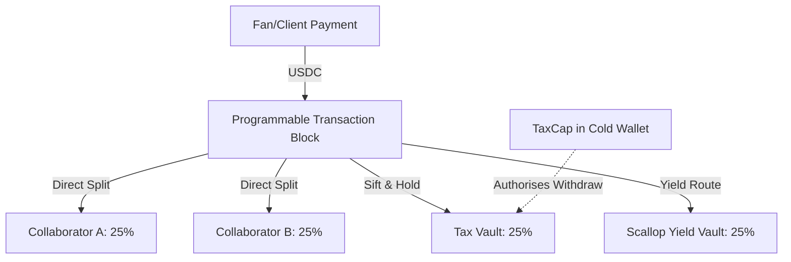

# SuiSieve 🌊🔮

> **Track 1: DeFi & Payments · Sui Overflow 2026**
>
> A programmable creator revenue router on Sui. Every incoming payment is automatically sifted into tax reserves, collaborator wallets, savings, and yield protocols in a single atomic transaction.

---

### The Pain Points 😭

*   **Platform Extortion**: Web2 channels (Patreon, OnlyFans, Twitch) extract **10% to 50%** in platform fees and hold payouts for days or weeks.
*   **Tax Shock**: Freelance creators face sudden cash-flow shocks because they manually manage self-employment tax reserves.
*   **Collaborator Chasing**: Splitting revenues with co-writers or contractors is manual, error-prone, and trust-dependent.
*   **Clunky Web3 Tools**: Current Web3 routing tools are **pull-based** (recipients must manually claim and pay gas) and fail to integrate automatic yield deposits.

---

### The Solution: SuiSieve 🧪

**SuiSieve** turns a creator's address into a **programmable revenue sieve**. 

Whenever an incoming payment hits the creator's inbox:
1.  **Atomic Sifting (PTB)**: A single Programmable Transaction Block splits the payment instantly based on a predefined `SplitConfig`.
2.  **Instant Payout (Push-Based)**: Collaborators receive their share directly into their wallets in the very same block—**no manual claims, no gas paid by recipients**.
3.  **Automated Tax & Yield**: A percentage is routed to a tax reserve, whilst another portion is deposited directly into Sui-native yield protocols (e.g., Scallop) to optimise interest compounding.
4.  **Type-Level Security**: Reserve vaults are gated by Move **Capability objects** (`TaxCap`/`SavingsCap`). Even if a creator's hot wallet is compromised, the reserved tax funds remain untouchable in cold storage.

---

### Key Features ✨

*   ⚡ **Atomic Routing**: One incoming payment triggers a multi-route split, yield deposit, and receipt NFT mint in one block.
*   🛡️ **Capability-Gated Vaults**: Built-in protection utilizing Move's native ownership model to lock up tax and savings reserves.
*   👥 **Web2-Friendly Onboarding**: Frictionless signup via **zkLogin** (Google auth) and gasless payment paths using **Sponsored Transactions**.
*   📈 **Immediate Compounding**: Converts idle creator revenue into yield-bearing assets automatically.

---

### How It Works ⚙️

*   **SplitConfig**: A shared object storing routing rules and collaborator allocations.
*   **Vaults**: Shared objects holding funds that can only be drained by presenting the corresponding `Cap` object.
