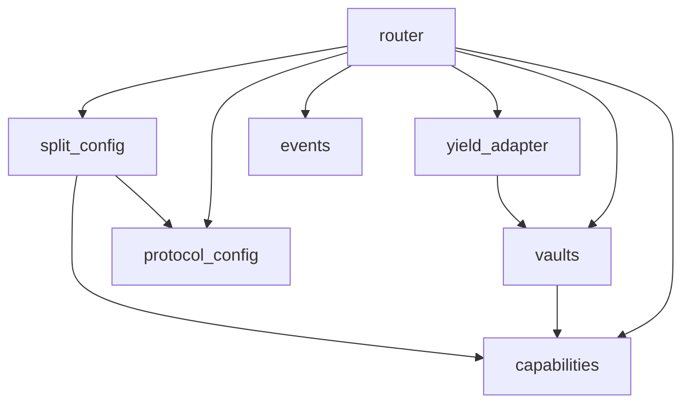

# CreatorFlow — System Architecture Specification

> Derived from `BUSINESS_SPEC.md` (2026-05-28). Target: Sui Overflow 2026 Track 1 MVP (6 weeks).
> Sui Protocol 124 / testnet v1.72.2. Move 2024 Edition. `@mysten/sui` SDK.
>
> **Rev. 2026-06-15** — post-implementation security audit (sui-security-guard + sui-red-team): no critical/high. Added `EZeroPayment` guard to `execute_split` §4.2 (threat T6b, zero-value spam). Other findings (rounding-favors-last-recipient, `@0x0` recipient) accepted as informational — see `move-notes.md`.
>
> **Rev. 2026-05-30** — architecture review patch: (1) corrected the yield "fallback" semantics (Move has no try/catch — see §7), (2) modeled the protocol take-rate in the object model (§3.2/§4.2), (3) flagged `Coin<USDC>` generic break-point, (4) quantified shared-vault contention (§9-T10), (5) added stale pay-link / version-refresh flow (§6.1).

---

## 0. Scope & Non-Goals

**In scope (MVP):** One Move package (`creatorflow`), one PTB entry path (`execute_split`), capability-gated vaults, Scallop testnet yield adapter, Next.js dashboard with dApp Kit + zkLogin onboarding.

**Out of scope (MVP):** Mainnet, fiat ramp, sponsored TX, k-of-n mutation governance, cross-chain inbox, subscription primitive, MCN dashboard. These are v1/v2 — architecture must not preclude them.

---

## 1. System Overview

```
┌─────────────┐    USDC payment     ┌──────────────────────────┐
│  Payer (Fan │ ─────────────────► │   PTB: execute_split     │
│  or Stripe  │                     │  ┌────────────────────┐  │
│  on-Sui)    │                     │  │ 1. Receive Coin    │  │
└─────────────┘                     │  │ 2. Split by bps    │  │
                                    │  │ 3. Transfer × N    │  │
        ┌───────────────────────────┤  │ 4. TaxVault::dep   │  │
        │                           │  │ 5. SavingsVault    │  │
        ▼                           │  │ 6. Yield adapter   │  │
┌─────────────────┐  reads          │  │ 7. Emit event      │  │
│  SplitConfig    │ ◄───────────────┤  └────────────────────┘  │
│  (shared obj)   │                 └──────────────────────────┘
└─────────────────┘                              │
                                                 ▼ event
                                    ┌──────────────────────────┐
                                    │  Indexer (gRPC stream)   │
                                    │  → Dashboard (Next.js)   │
                                    └──────────────────────────┘
```

**Trust boundaries:**
- **On-chain (trusted):** SplitConfig allocations, capability checks, vault balances.
- **Off-chain (untrusted):** Pay-link URLs (stateless), indexer (read-only), dashboard.
- **Owned-object boundary:** `OwnerCap`, `TaxCap`, `SavingsCap` — compromise of one does not cascade.

---

## 2. Module Architecture

Single package `creatorflow`, 7 modules. Dependency direction is acyclic (lower = depended upon).



| Module | Responsibility | Key types |
|---|---|---|
| `capabilities` | Define owned-object Cap types, no logic | `OwnerCap`, `TaxCap`, `SavingsCap`, `RecipientLockCap` (v1) |
| `split_config` | SplitConfig shared object, mutation API | `SplitConfig`, `Recipient`, `MutationPolicy` |
| `protocol_config` | Protocol-level treasury + fee bounds | `ProtocolConfig`, `AdminCap` |
| `vaults` | Tax + Savings vaults, gated deposit/withdraw | `TaxVault`, `SavingsVault` |
| `yield_adapter` | Scallop USDC supply wrapper | `StrategyRef`, `YieldReceipt` |
| `router` | `execute_split` PTB entry — the atomic flow | (entry functions only) |
| `events` | Structured event types for indexer | `SplitExecuted`, `ConfigMutated`, `VaultWithdrawn` |

**Why 7 modules not 1:** keeps capability definitions away from logic (audit surface ↓), lets `yield_adapter` be swapped (Scallop → Navi → Suilend) without touching `router`, and isolates protocol-level config (`protocol_config`) from per-creator state.

---

## 3. Data Structures

### 3.1 Capabilities (`capabilities.move`)

```move
public struct OwnerCap has key, store { id: UID, config_id: ID }
public struct TaxCap has key, store { id: UID, vault_id: ID }
public struct SavingsCap has key, store { id: UID, vault_id: ID }
public struct RecipientLockCap has key, store { id: UID, config_id: ID, holder: address } // v1
```

All `key + store` → transferable to cold wallet / accountant. Each Cap binds to a specific object ID — stealing one Cap gives access only to that vault, not the system.

### 3.2 SplitConfig (`split_config.move`)

```move
public struct Recipient has store, copy, drop {
    addr: address,
    bps: u16,       // basis points, 1-10000
    label: vector<u8>,
}

public struct SplitConfig has key {
    id: UID,
    owner: address,                 // for display only; auth uses OwnerCap
    version: u64,                   // bump on every mutation; PTB asserts expected version
    recipients: vector<Recipient>,  // max 16 to bound gas
    tax_bps: u16,
    savings_bps: u16,
    protocol_fee_bps: u16,          // monetization: protocol take-rate (e.g. 30 = 0.3%); bounded by ProtocolConfig.max_fee_bps
    yield_bps: u16,                 // slice of savings → yield, 0 if disabled
    tax_vault_id: ID,
    savings_vault_id: ID,
    yield_strategy: Option<StrategyRef>,
    mutation_policy: MutationPolicy,
}

public enum MutationPolicy has store, copy, drop {
    OwnerOnly,                      // MVP default
    OwnerPlusLockHolders { k: u8 }, // v1 — k-of-n of RecipientLockCap holders
}
```

**Invariant (enforced in `create` and `mutate`):** `sum(recipients.bps) + tax_bps + savings_bps + protocol_fee_bps == 10000`. `yield_bps` is a sub-allocation of `savings_bps` (carved at execute time), not added to the sum.

**Monetization model (BUSINESS_SPEC §10).** The 0.3% take-rate is `protocol_fee_bps`, carved in the same split and `public_transfer`'d to the treasury address read from a package-level shared `ProtocolConfig` object (see §3.5). `create`/`mutate` assert `min_fee_bps <= protocol_fee_bps <= max_fee_bps` so the protocol cannot retroactively inflate a creator's fee, and the creator cannot underset it below the protocol floor. `ProtocolConfig` is read via immutable `&` reference on the hot path → no shared-object contention.

### 3.3 Vaults (`vaults.move`)

```move
public struct TaxVault has key {
    id: UID,
    balance: Balance<USDC>,
    config_id: ID,           // back-pointer for indexer joins
    total_deposited: u64,    // monotonic, for analytics
    total_withdrawn: u64,
}

public struct SavingsVault has key {
    id: UID,
    balance: Balance<USDC>,
    config_id: ID,
    yield_position: Option<ScallopPositionRef>,
    total_deposited: u64,
    total_withdrawn: u64,
}
```

Both are **shared objects** (so PTB can deposit without owner signing); withdraw requires `&TaxCap` / `&SavingsCap` reference — that reference can only be obtained by the Cap owner.

### 3.4 Events (`events.move`)

```move
public struct SplitExecuted has copy, drop {
    config_id: ID,
    config_version: u64,
    amount_in: u64,
    recipient_payouts: vector<RecipientPayout>,
    tax_amount: u64,
    savings_amount: u64,
    protocol_fee_amount: u64,
    yield_amount: u64,
    yield_included: bool,   // whether the yield deposit call was in this PTB (see §7) — NOT a runtime fallback flag
    timestamp_ms: u64,
}

public struct RecipientPayout has copy, drop { addr: address, amount: u64, bps: u16 }
public struct ConfigMutated has copy, drop { config_id: ID, old_version: u64, new_version: u64, mutator: address }
public struct VaultWithdrawn has copy, drop { vault_id: ID, kind: u8 /*0=tax,1=savings*/, amount: u64, to: address }
```

> **Why not `yield_success: bool`?** (rev. 2026-05-30) An on-chain Scallop abort reverts the whole PTB, so the event never emits — a `false` value is unobservable. `yield_included` records the client's construct-time decision (yield on/off), which *is* observable. See §7.

### 3.5 ProtocolConfig (`protocol_config.move`)

```move
public struct ProtocolConfig has key {
    id: UID,
    treasury: address,       // where protocol_fee slices land
    min_fee_bps: u16,        // floor (e.g. 30)
    max_fee_bps: u16,        // ceiling, anti-abuse (e.g. 100)
}
public struct AdminCap has key, store { id: UID }  // gates treasury/bounds updates
```

Created once at publish (`init`), shared. Mutating `treasury`/bounds requires `&AdminCap`. Read-only (immutable `&`) on the `execute_split` hot path → no contention.

---

## 4. Core Functions / API

### 4.1 Setup (one-time, creator)

```move
public fun create_split_config(
    protocol: &ProtocolConfig,
    recipients: vector<Recipient>,
    tax_bps: u16,
    savings_bps: u16,
    protocol_fee_bps: u16,
    yield_bps: u16,
    yield_strategy: Option<StrategyRef>,
    ctx: &mut TxContext,
): (OwnerCap, TaxCap, SavingsCap)
// Side effects: shares SplitConfig + TaxVault + SavingsVault; transfers Caps to sender.
// Aborts: EInvalidBps if sum(recipients)+tax+savings+protocol_fee != 10000,
//         ETooManyRecipients if len > 16,
//         EFeeOutOfBounds if protocol_fee_bps not in [protocol.min_fee_bps, protocol.max_fee_bps].
```

### 4.2 The PTB hot path (`router.move`)

```move
public fun execute_split(
    config: &SplitConfig,
    protocol: &ProtocolConfig,
    tax_vault: &mut TaxVault,
    savings_vault: &mut SavingsVault,
    payment: Coin<USDC>,
    include_yield: bool,     // client decides; see §7 — this is the only "fallback" lever
    expected_version: u64,   // payer asserts they're paying into the config they saw
    clock: &Clock,
    ctx: &mut TxContext,
)
// 1. assert config.version == expected_version          [EConfigChanged]
// 2. assert tax_vault.config_id == config.id
//    && savings_vault.config_id == config.id            [EVaultMismatch]
// 2b. assert payment.value() > 0                         [EZeroPayment]  (T6 spam guard, rev. 2026-06-15)
// 3. split coin into N+3 sub-coins by bps (recipients + tax + savings + protocol_fee)
//    use floor division on u128 intermediates; remainder → last recipient (no dust loss)
// 4. transfer::public_transfer each recipient slice
// 5. transfer::public_transfer protocol_fee slice → protocol.treasury
// 6. tax_vault.deposit(tax_coin)
// 7. let yield_coin = carve yield_bps from the savings slice
//    if config.yield_strategy.is_some() && include_yield:
//        yield_adapter::deposit(savings_vault, yield_coin, strategy)   // aborts ⇒ whole PTB reverts (§7)
//    else:
//        savings_vault.deposit(yield_coin)                             // yield slice stays in savings
//    savings_vault.deposit(savings_minus_yield_coin)
// 8. emit SplitExecuted { ..., yield_included: include_yield && strategy.is_some() }
```

**Why `&SplitConfig` (immutable) for the duration:** prevents config mutation racing with split execution — Move's reference rules linearize this for free.

> **Generic break-point (rev. 2026-05-30).** `payment: Coin<USDC>` is hard-coded. The cross-chain/multi-asset inbox (BUSINESS_SPEC v2) requires `execute_split<T>(... payment: Coin<T> ...)`, which changes the vault types (`TaxVault<T>`/`SavingsVault<T>`) and is a **non-compatible upgrade**. Decision: stay monomorphic `USDC` for MVP; treat genericization as a deliberate v1→v2 redeploy, not a hot upgrade. Tracked in §15.

### 4.3 Vault withdraw

```move
public fun withdraw_tax(vault: &mut TaxVault, cap: &TaxCap, amount: u64, ctx: &mut TxContext): Coin<USDC>
// assert cap.vault_id == object::id(vault)  [EWrongCap]
// emit VaultWithdrawn
```

Same shape for `withdraw_savings`. Cap binding is per-vault, so cap reuse across vaults is impossible.

### 4.4 Mutation

```move
public fun update_recipients(
    config: &mut SplitConfig,
    owner_cap: &OwnerCap,
    new_recipients: vector<Recipient>,
    new_tax_bps: u16,
    new_savings_bps: u16,
    /* v1: lock_caps: vector<&RecipientLockCap> for k-of-n */
    ctx: &mut TxContext,
)
// assert owner_cap.config_id == config.id
// assert bps sum == 10000
// version += 1; emit ConfigMutated
```

---

## 5. Capability / Permission Matrix

| Action | Required Cap | Object held by | Compromise impact |
|---|---|---|---|
| Create config | none (anyone) | — | Creates new isolated config |
| `execute_split` | none | — | Permissionless push (intentional) |
| Mutate recipients | `OwnerCap` | Creator hot wallet | Reroute future payments |
| Decrease collab bps (v1) | `OwnerCap` + k `RecipientLockCap` | Collaborators | Cannot grief one collab |
| Withdraw tax | `TaxCap` | Creator cold wallet / accountant | Drain tax vault only |
| Withdraw savings | `SavingsCap` | Creator cold wallet | Drain savings vault only |
| Withdraw yield position | `SavingsCap` (via `yield_adapter`) | Creator cold wallet | Drain yield only |
| Set treasury / fee bounds | `AdminCap` | Protocol deployer multisig | Reroute *future* fees only; cannot touch creator vaults or recipient slices |

**Design rule:** never combine Caps into a "SuperCap". Compromise blast radius = exactly one Cap. `AdminCap` is protocol-scoped and orthogonal to every creator's `OwnerCap`/`TaxCap`/`SavingsCap` — protocol compromise cannot drain creator funds, only redirect the protocol's own fee slice on subsequent splits.

---

## 6. PTB Construction (off-chain, TS SDK)

```ts
import { Transaction } from "@mysten/sui/transactions";

const tx = new Transaction();
const [paymentCoin] = tx.splitCoins(tx.gas, [tx.pure.u64(amountMicroUSDC)]); // demo only; real flow uses USDC coin

tx.moveCall({
  target: `${pkg}::router::execute_split`,
  arguments: [
    tx.object(splitConfigId),
    tx.object(protocolConfigId),  // shared ProtocolConfig (treasury + fee bounds)
    tx.object(taxVaultId),
    tx.object(savingsVaultId),
    paymentCoin,
    tx.pure.bool(includeYield),   // false ⇒ Scallop-skip retry path (§7)
    tx.pure.u64(expectedVersion),
    tx.object("0x6"), // Clock
  ],
});
```

**Pay-link service** is stateless: URL params → serialized unsigned PTB → wallet redirect. No backend custody.

### 6.1 Stale pay-link / version-refresh flow (rev. 2026-05-30)

`execute_split` aborts with `EConfigChanged` if `expected_version != config.version`. Because pay-links are long-lived and `execute_split` is a permissionless push, **any creator config mutation invalidates every outstanding pay-link** — a fan signing a stale link gets a revert. Mitigation (client-side, no contract change):

1. The pay-link encodes only `config_id` + chosen amount — **never a pinned version**.
2. At sign time, the dApp **reads the current `config.version` via gRPC** and injects it as `expected_version` immediately before building the PTB.
3. The signed window is sub-second; the only failure case is a mutation landing between read and sign → the wallet shows "creator just updated their split, re-confirm" and re-reads. This is rare and self-healing.

> Do **not** bake `expected_version` into the static pay-link URL — that reintroduces the stale-link revert at scale. The version is a sign-time read, not a link parameter.

---

## 7. Yield Adapter Pattern

```move
// yield_adapter.move
public struct StrategyRef has store, copy, drop { kind: u8, pool_id: ID }

public fun deposit(
    savings_vault: &mut SavingsVault,
    coin: Coin<USDC>,
    strategy: &StrategyRef,
) {
    // Wraps the Scallop supply call. This CAN abort (pool paused, min-deposit, version drift).
    // There is NO in-Move catch — an abort here reverts the entire enclosing PTB. That is intentional;
    // see the failure-model note below.
}
```

**Reality check — Move has no try/catch, so there is no runtime "fallback to savings".** (rev. 2026-05-30, correcting BUSINESS_SPEC §9 wording.) Within a single PTB, a Scallop abort reverts *everything*, including the recipient transfers. "PTB ordering" gives all-or-nothing, **not** graceful degradation. We support two explicit modes, and the decision is made off-chain at PTB-construction time via the `include_yield` flag:

| Mode | Behavior on Scallop downtime | Atomicity | Use |
|---|---|---|---|
| **A. Atomic-with-yield** (demo default) | `include_yield = true` → Scallop deposit is in-PTB. If it aborts, the **whole split reverts**; the dashboard observes the failure and **retries with `include_yield = false`** (the "fallback" is this off-chain retry — the yield slice then lands in `SavingsVault`). | Split+yield succeed together or not at all | Hackathon demo: "6 ops in one tx" |
| **B. Decoupled** (production-robust) | `execute_split` always routes the yield slice into `SavingsVault`; a **separate scheduled sweep PTB** (`yield_adapter::sweep`) moves savings → Scallop later. `execute_split` never depends on Scallop uptime. | Split is always atomic; yield is eventual | v1, high-frequency creators |

MVP ships **Mode A** (matches the §12 demo of an in-PTB Scallop deposit) with the client-retry fallback. The `yield_included` event field records which path ran. Mode B is the documented v1 hardening — it removes Scallop from the payment-critical path entirely.

---

## 8. Off-Chain Components

| Component | Stack | Responsibility | Notes |
|---|---|---|---|
| Dashboard | Next.js 15 + dApp Kit + Tailwind | Wallet connect (zkLogin), create/manage config, view history | App Router, RSC where possible |
| Indexer | Sui gRPC subscription → Postgres | Stream `SplitExecuted` events, expose REST/GraphQL | Use Sui's adaptive-concurrency framework (Protocol 124) |
| Pay-link service | Stateless edge function | Build unsigned PTB from URL params | Vercel Edge or Cloudflare Worker |
| Notification (v1) | Web push + email digest | Notify collaborators on receipt | Not MVP |

**Data access decision:**
- **Live dashboard / current vault balances** → gRPC (primary).
- **Historical splits / search by collaborator** → custom indexer (Postgres + Drizzle).
- **Frontend ad-hoc queries** → GraphQL beta.
- **JSON-RPC:** avoid (deprecated, removal April 2026).

---

## 9. Security Considerations

See `docs/security/threat-model.md` for full STRIDE. Highlights:

| # | Threat | Mitigation |
|---|---|---|
| T1 | Hot-wallet compromise drains tax vault | `TaxCap` is separate owned object; held in cold storage or by accountant |
| T2 | Config mutation races a payment, payer paid into the wrong split | PTB takes `&SplitConfig` (immutable) + `expected_version` assertion |
| T3 | Recipient bps overflow / underflow | All arithmetic on u64 with `u128` intermediates in bps math; sum asserted == 10000 |
| T4 | Cap reuse across vaults | Each Cap stores target `vault_id`; asserted on use |
| T5 | Yield protocol revert blocks split | **No in-Move fallback exists** (Move has no try/catch). Mode A: Scallop abort reverts the whole PTB; client retries with `include_yield=false`. Mode B (v1): yield decoupled to a separate sweep tx, removing Scallop from the payment path. See §7. |
| T11 | Protocol sets `protocol_fee_bps` arbitrarily high to skim creators | `create`/`mutate` assert `protocol_fee_bps ≤ ProtocolConfig.max_fee_bps`; `max_fee_bps` change needs `AdminCap` and is observable on-chain; creators can read it before signing |
| T6 | Recipient list griefed by adding 10k entries | Max 16 recipients; bounds gas + abuse |
| T6b | Zero-value `execute_split` spam (permissionless push) → mints a zero-coin object at every recipient (object bloat) + emits junk `SplitExecuted` (indexer poisoning) at only gas cost | `assert payment.value() > 0` [EZeroPayment] (rev. 2026-06-15, audit finding L1) |
| T7 | Dust / rounding loss | Floor-divide, remainder credited to last recipient (documented) |
| T8 | Collab bps cut without consent (post-v1) | `RecipientLockCap` k-of-n required to decrease |
| T9 | Fake config impersonation | Vault.config_id ↔ Config.{tax,savings}_vault_id cross-check on every `execute_split` |
| T10 | DoS via shared-object congestion | `SplitConfig` + `ProtocolConfig` reads are non-conflicting. **But every `execute_split` takes `&mut` on BOTH `TaxVault` and `SavingsVault`** → all concurrent payments to one creator serialize through consensus on those two shared objects. For the UC-2 "350 fans" burst this caps single-creator throughput at Sui's per-shared-object commit rate (~hundreds/s, not parallel). Acceptable for MVP; **must be load-tested** (§11). v1 mitigation if it bottlenecks: shard per-vault into N sub-vaults round-robined by payment, or accumulate via fast-path owned `Coin` transfers + periodic vault sweep. |

**No reentrancy concerns** — Move resource model + Sui's PTB linearization.

**Red-team queue** (run `sui-red-team` before mainnet): cap forgery via `transfer::public_transfer` to attacker, version-bump races, integer truncation in bps math, malicious `StrategyRef` injection, gas exhaustion via 16-recipient + yield path.

---

## 10. Ecosystem Tool Integration

| Tool | MVP? | Why / How |
|---|---|---|
| **zkLogin** | ✅ | Creator onboarding via Google — derives Sui address, holds `OwnerCap` |
| **Scallop** | ✅ | USDC supply on testnet, yield adapter target |
| **Sponsored TX** | v1 | Fan-side gasless payment |
| **Walrus** | optional | Store creator avatar / config metadata (not balances) |
| **SuiNS** | v1 | `maya.sui` → pay-link resolution |
| **Kiosk** | ❌ | Not NFT |
| **DeepBook** | ❌ | Not order-book |
| **Seal** | v2 | Fan privacy for adult creators (encrypted recipient identities) |
| **Passkey** | v1 alt | Alternative to zkLogin for non-Google users |
| **Nautilus** | v1 | Tax-rate oracle (off-chain attested rate signed into config update) |

---

## 11. Testing Strategy

| Layer | Tool | Coverage target |
|---|---|---|
| Unit (Move) | `sui move test` | All entry functions, all abort codes, bps boundary (0, 1, 9999, 10000) |
| Property | Move PBT (custom) | Sum invariant: ∀ payment ∀ config, sum(payouts) == amount_in |
| Integration | TS SDK + localnet | Full PTB: 16-recipient + yield, version-mismatch revert, cap-mismatch revert |
| Adversarial | `sui-red-team` | 5 attack vectors listed in §9 |
| Monkey | Random fuzzer | Random bps, random recipients, random payment sizes; assert invariants; assert `sum(payouts)+tax+savings+fee == amount_in` (no dust leak) |
| Contention | localnet load test | N concurrent `execute_split` on one creator (UC-2 350-fan burst); measure shared-vault serialization throughput & latency — validates T10 |
| Gas | `sui-dev-agents:gas` | `execute_split` < 0.005 SUI for 16 recipients + yield |

**Gate:** `sui move test` + integration suite green before any deploy.

---

## 12. Deployment Plan

```
devnet  ──── shake-out, indexer wiring (week 4)
   │
testnet ──── design-partner creators, demo recording (week 5–6)
   │
mainnet ──── post-hackathon, after audit + sponsored-TX integration (v1)
```

- **UpgradeCap** held by deployer multisig from day 1 (never single-key).
- **No state migration** at MVP — if breaking change needed before mainnet, redeploy fresh package; testnet state is disposable.
- **Versioning:** package version bumped via `sui-deployer`; Cap types are stable across upgrades by design.

---

## 13. Gas & Performance Budget

| Op | Target | Notes |
|---|---|---|
| `create_split_config` (4 recipients) | < 0.01 SUI | One-time |
| `execute_split` (4 recipients + tax + savings + yield) | < 0.003 SUI | Hot path |
| `execute_split` (16 recipients + yield) | < 0.008 SUI | Worst case |
| `withdraw_tax` | < 0.002 SUI | Rare |

Run `sui-dev-agents:gas` after each `router.move` change.

---

## 14. File Layout

```
move/
  creatorflow/
    Move.toml
    sources/
      capabilities.move
      split_config.move
      protocol_config.move
      vaults.move
      yield_adapter.move
      router.move
      events.move
    tests/
      router_tests.move
      vaults_tests.move
      split_config_tests.move
      integration_tests.move

web/
  app/
    (dashboard, pay-link)
  lib/
    sui-client.ts
    ptb-builder.ts

indexer/
  src/
    events-consumer.ts
    db/schema.ts
```

---

## 15. Open Architectural Questions

(Promoted from BUSINESS_SPEC §14 — to resolve before v1)

1. **Yield-adapter pattern** *(partially resolved 2026-05-30)*: MVP = Mode A (in-PTB Scallop deposit, client-retry on abort). v1 = Mode B (decoupled sweep tx). A true "never-abort wrapper" is **impossible** in one PTB because a cross-package abort can't be caught — see §7. Remaining question: at what payment volume do we cut over from A to B?
6. **`Coin<USDC>` → `Coin<T>` genericization**: required for the v2 cross-chain inbox; it's a non-compatible upgrade (vault types change). Confirm whether to genericize at the v1→v2 redeploy or sooner. See §4.2 break-point note.
7. **Shared-vault sharding (T10)**: if the §11 contention test shows single-creator throughput is a real ceiling, choose the v1 mitigation (N sub-vaults vs fast-path owned-coin accumulation + sweep).
2. **MutationPolicy enum vs witness-pattern**: enum is simpler; witness allows pluggable policies. MVP enum, v1 reconsider.
3. **Indexer ownership**: self-host vs Mysten public indexer. SLA + margin trade-off.
4. **Cross-vault accounting**: do we need a single `CreatorBook` shared object aggregating both vaults for analytics, or is event-stream-only sufficient? Lean event-only; revisit if MCN dashboard needs sub-second aggregates.
5. **Tax-rate oracle shape**: signed config update (creator-pull) vs shared oracle object (config reads at exec time). Latter is more elegant but adds shared-object contention.

---

## 16. Acceptance Criteria (MVP)

- [ ] `sui move test` green, 100% of public entry functions covered
- [ ] Localnet PTB demo: 5-way split + Scallop deposit + event emission in one tx
- [ ] Capability rejection test: hot-wallet withdraw from tax vault aborts with `EWrongCap`
- [ ] Dashboard: zkLogin onboarding → create config → simulate payment → see split history (< 2s end-to-end)
- [ ] One real testnet design partner has a live `SplitConfig` and ≥ 3 historical splits
- [ ] Gas budget §13 met
- [ ] `sui-security-guard` + `sui-red-team` reports clean / triaged

---

*Spec author: Claude (sui-architect). Source: `BUSINESS_SPEC.md` 2026-05-28. Next step: `sui-developer` for `capabilities.move` + `split_config.move` first, then `vaults.move`, then `router.move`.*
